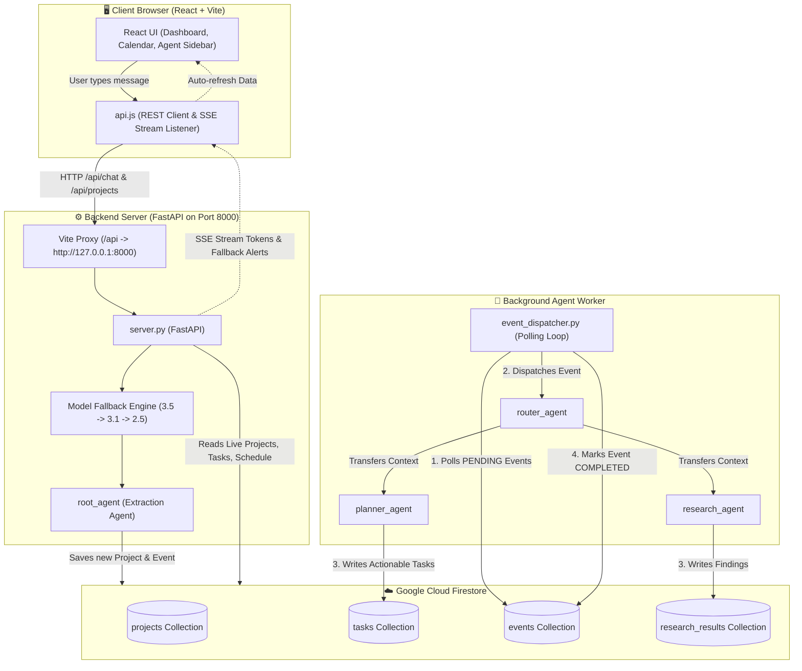
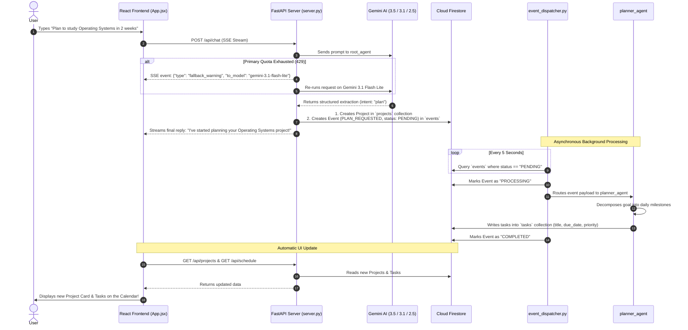
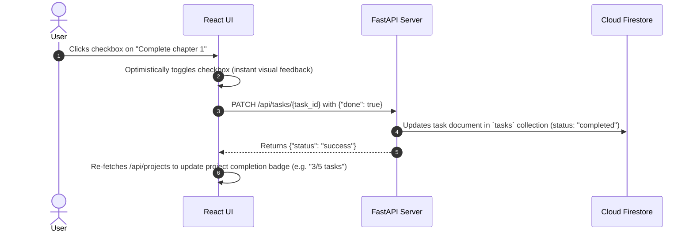
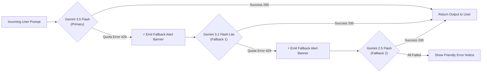

# 🧠 Cognitive Canvas: Architecture & Data Flow Guide

This document explains **how data moves between the Frontend, the Backend Server, the AI Agents, and the Database (Firestore)** in Cognitive Canvas.

---

## 🌟 The Big Picture (Simple Analogy)

Think of Cognitive Canvas like a **smart restaurant**:

1. **The Customer (Frontend / React UI):** You sit at the table and say: *"Plan my 2-week Linux study schedule."*
2. **The Waiter (FastAPI Unified Server):** Takes your order from the table to the kitchen via a secure tray (REST APIs & Server-Sent Events).
3. **The Head Chef (`root_agent`):** Doesn't cook everything immediately. Instead, writes down an organized ticket: *"New Linux Project with Goal X"* and posts it on the order board (Firestore Database).
4. **The Order Dispatcher (`event_dispatcher.py`):** Constantly watches the order board in the background. As soon as a new ticket appears, passes it to the specialized cooks.
5. **The Specialist Cooks (`router_agent`, `planner_agent`, `research_agent`):**
   * The **Router** reads the ticket and decides who should do the work.
   * The **Planner** breaks the goal down into specific, dated study tasks (e.g. *"Read chapter 1 on Day 1"*).
   * The **Researcher** looks up books and tutorials using Google Search.
6. **The Menu Board (Firestore Database):** Stores all projects and tasks.
7. **The Live Screen (Frontend Dashboard & Calendar):** Automatically updates in real time so the customer sees their generated schedule and can check off tasks as they finish them!

---

## 🏗️ Architecture Diagram



---

## 🧩 The 4 Main Components

| Component | Technology | Role in the System |
| :--- | :--- | :--- |
| **1. Frontend** | React, Vite, Tailwind CSS | The visual user interface. Displays Project cards, the 1-year interactive Calendar, and the collapsible AI Chat Sidebar. |
| **2. Unified Server** | Python, FastAPI, Uvicorn (`server.py`) | Acts as the central gateway. Manages REST APIs (`/api/projects`, `/api/schedule`, `/api/tasks`) and streams AI chat with automatic model fallback (`/api/chat`). |
| **3. Database** | Google Cloud Firestore | Cloud NoSQL database holding all persistent data across 4 collections: `projects`, `tasks`, `events`, and `research_results`. |
| **4. Multi-Agent Engine** | Google ADK & Gemini 3.5 Flash | Intelligent background workers (`event_dispatcher.py`, `router_agent`, `planner_agent`, `research_agent`) that decompose large goals into schedules and conduct web research. |

---

## 🔄 End-to-End Data Flows

### Flow 1: When a User Sends a Goal / Plan Request



---

### Flow 2: How the Calendar & Schedule View Works

1. **1-Year Generation:** The React frontend automatically computes a 12-month calendar horizon (from current date through 1 year ahead).
2. **Task Mapping by Date:**
   * When `GET /api/schedule` is fetched, the frontend receives all tasks with their `due_date` (e.g. `2026-08-30`, `2026-09-14`).
   * For every date on the calendar, if tasks exist for that date, a **blue indicator dot** is drawn under the date number (or a **green dot** if all tasks for that day are marked completed).
3. **Date Selection & Filtering:**
   * **Clicking Today:** Shows tasks due today + any unassigned active backlog tasks.
   * **Clicking a Specific Future Date:** Filters and displays only tasks scheduled for that exact date (`task.dueDate === selectedDate`).
   * **Clicking a Past Date:** Displays tasks completed or scheduled on that past date.
4. **Quick-Add Task:**
   * Typing in `+ Add task for [Selected Date]...` sends a `POST /api/tasks` request to `server.py`, which writes directly to Firestore and updates both the schedule list and the calendar dot live.

---

### Flow 3: Checking Off / Completing a Task



---

### Flow 4: Automatic Quota Fallback (3.5 ➔ 3.1 ➔ 2.5)



* **No Crashes:** If your Gemini 3.5 Flash rate limit is hit, the user doesn't see a raw server crash or 500 error.
* **Instant Re-route:** The server catches `429` / `RESOURCE_EXHAUSTED`, sends a warning banner to the UI sidebar, and immediately completes the query using the next model in line.

---

## 🗄️ Firestore Database Schema Reference

```
negnq-agenticassistant (Firestore Project)
│
├── 📂 projects/
│   └── 📄 {project_id}
│       ├── title: string (e.g. "Linux Learning Curriculum")
│       ├── summary: string (e.g. "Comprehensive 2-week plan for Linux...")
│       ├── deadline: string | null
│       └── status: "active" | "completed"
│
├── 📂 tasks/
│   └── 📄 {task_id}
│       ├── project_id: string (links to parent project)
│       ├── title: string (e.g. "Read Chapter 1: Introduction to Kernels")
│       ├── task_type: "reading" | "research" | "study" | "task"
│       ├── priority: "high" | "medium" | "low"
│       ├── due_date: string (ISO date e.g. "2026-08-30")
│       ├── estimated_minutes: number (e.g. 90)
│       ├── details: string
│       └── status: "queued" | "in-progress" | "completed"
│
├── 📂 events/
│   └── 📄 {event_id}
│       ├── type: "PLAN_REQUESTED" | "TASK_CREATED" | "RESEARCH_REQUESTED"
│       ├── entity_id: string
│       ├── payload: dict (raw event parameters)
│       ├── status: "PENDING" | "PROCESSING" | "COMPLETED" | "FAILED"
│       └── attempt_count: number
│
└── 📂 research_results/
    └── 📄 {result_id}
        ├── project_id: string
        ├── query: string
        ├── summary: string (researched findings)
        └── status: "COMPLETED"
```

---

## 🚀 How to Run the Whole Stack

Open **3 terminals**:

```bash
# Terminal 1: Backend API & AI Server
cd cognitive_canvas/cognitive_canvas
python3 server.py

# Terminal 2: Background Multi-Agent Dispatcher
cd cognitive_canvas/cognitive_canvas/services
python3 event_dispatcher.py

# Terminal 3: React Frontend Web UI
cd frontend
npm run dev
```

Visit `http://localhost:5173` in any browser!
