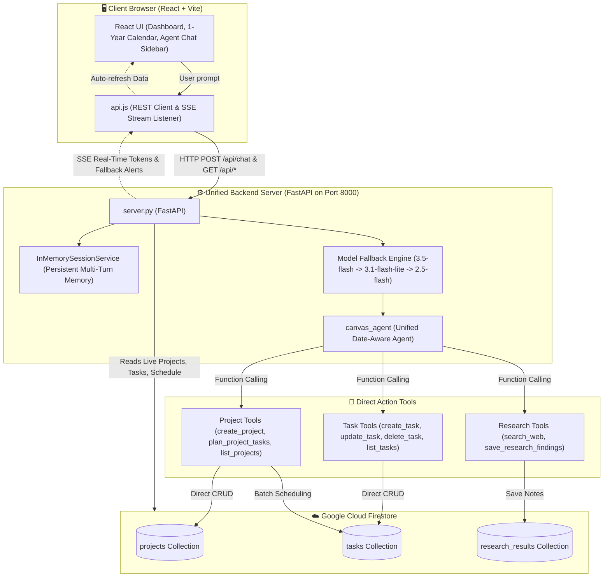

# 🧠 Cognitive Canvas: Architecture & Data Flow Guide (v2)

This document explains the unified architecture and data flow between the React Frontend, the FastAPI Unified Server, the Date-Aware AI Agent, and Google Cloud Firestore.

---

## 🌟 The Big Picture (Simple Analogy)

Cognitive Canvas operates like a **personal executive assistant**:

1. **You (Frontend / React UI):** You say: *"Schedule a movie date on the 14th"* or *"Plan a 2-week Operating Systems study schedule."*
2. **The Gateway (FastAPI Server / `server.py`):** Receives your message, connects to the conversational session, and manages live streaming and model quota fallbacks.
3. **The Executive Agent (`agent.py`):**
   * **Date-Aware:** Knows today's exact date and resolves relative dates (e.g. "the 14th" ➔ `2026-09-14`).
   * **Direct Execution:** Uses dedicated tools to act immediately on Firestore without intermediate dispatchers or delays.
   * **Proportional Action:**
     * *Simple Event/Reminder* ➔ Creates **1 standalone task** on the calendar. No project created.
     * *Complex Goal* ➔ Creates a **Project** + batch-schedules daily actionable tasks across the timeline.
     * *Research Request* ➔ Searches the web and saves reference notes to the project.
     * *Task Modification* ➔ Updates or completes existing tasks.
     * *General Chat* ➔ Converses helpfully without database writes.
4. **The Database (Google Cloud Firestore):** Real-time storage of all projects, tasks, and research notes.
5. **The Live UI (Dashboard & 1-Year Calendar):** Automatically refreshes to show tasks on the exact scheduled dates!

---

## 🏗️ Architecture Diagram



---

## 🧩 The 5 Core Intent Categories

| Intent Category | User Examples | Agent Action | Database Write |
| :--- | :--- | :--- | :--- |
| **1. Simple Task / Event** | *"Schedule a movie date on the 14th"*, *"Doctor appointment tomorrow"* | Calls `create_task(title, due_date="2026-09-14")` | 1 Task in `tasks` (No Project created) |
| **2. Complex Project / Plan** | *"Plan a 2-week OS study schedule"*, *"30-day Java roadmap"* | Calls `create_project(...)` then `plan_project_tasks(...)` | 1 Project + N daily dated Tasks |
| **3. Web Research** | *"Best books for Linux programming"*, *"JEE Physics key topics"* | Calls `search_web(...)` + `save_research_findings(...)` | 1 entry in `research_results` |
| **4. Task Management** | *"Mark Linux chapter 1 as done"*, *"Move movie date to Friday"* | Calls `update_task(...)` or `delete_task(...)` | Updates/Deletes task in `tasks` |
| **5. General Chat** | *"Hi!"*, *"What can you do?"*, *"Thanks!"* | Conversational response | Zero database writes |

---

## 🚀 How to Run the System

You now only need **2 terminals** (or 1 in production):

```bash
# Terminal 1: Unified Backend Server (Port 8000)
cd cognitive_canvas/cognitive_canvas
python3 server.py

# Terminal 2: React Frontend UI (Port 5173)
cd frontend
npm run dev
```
