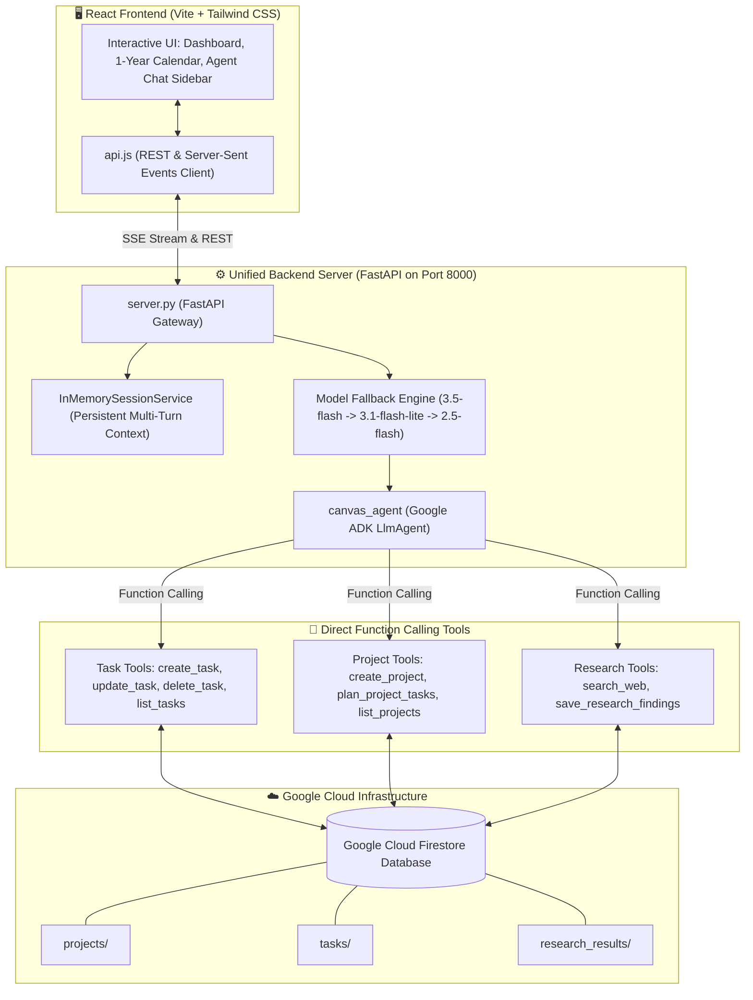

# 🧠 Cognitive Canvas: Autonomous AI Workspace

> **Track:** Taskmaster — *Build a complete workflow, not just a chatbot.*  
> **Built with:** Gemini 3.5 Flash, Google Agent Development Kit (ADK), Google Cloud Firestore, FastAPI, & React.

---

## 💡 Overview & Value Proposition

Most AI assistants today are passive chatbots: they wait for you to ask questions and output blocks of text that you have to manually copy, organize, and schedule yourself. 

**Cognitive Canvas is different.** It is an autonomous personal workspace and productivity engine designed to take real action. 

Whether you dump an unstructured brain dump (*"I need a 2-week study plan for my Operating Systems exam starting tomorrow"*) or a casual reminder (*"Schedule a movie date on the 14th"*), Cognitive Canvas:
1. **Understands Intent Proportionally:** It never creates an unnecessary multi-week project for a simple 1-off movie reminder, but it will automatically construct a 14-day daily milestone plan for an exam.
2. **Applies Temporal Intelligence:** It grounds all relative dates ("next Friday", "on the 14th", "in 2 weeks") into exact calendar dates.
3. **Directly Executes via Google Cloud:** It calls structured tools using Google ADK to persist tasks, schedule deadlines, and save research findings directly into **Google Cloud Firestore**.
4. **Displays Live in an Interactive 1-Year Calendar:** The workspace immediately renders your live project cards, checklist milestones, and 12-month calendar horizon.

---

## 🏗️ Architecture & Data Flow



---

## ✨ Key Features

### 1. 🎯 Proportional Multi-Intent Engine
* **Single Tasks & Reminders:** *"Schedule a movie date on the 14th"* ➔ Resolves target date (`2026-09-14`) and schedules **only 1 task** on the calendar. No project bloat.
* **Complex Multi-Week Projects:** *"Plan a 2-week Operating Systems study plan"* ➔ Creates a Project container and batch-schedules 14 dated daily tasks with duration estimates (90m, 120m) and priorities.
* **Web Research & Syllabus Grounding:** Searches for top textbooks and video resources, saving summarized notes directly into the project's **Notes & Findings** panel.
* **Task & Schedule Management:** Modifies, reschedules, or marks tasks completed in Firestore via natural language.
* **Multi-Turn Persistent Context:** Remembers past conversation turns for seamless follow-up queries.

### 2. 🗓️ 1-Year Scrollable Horizon Calendar
* Smooth, vertically scrollable 12-month calendar (August 2026 – July 2027).
* Mathematical date alignment for all 365 days.
* **Date-Filtered Schedule:** Clicking any date isolates and displays only tasks scheduled for that specific day.
* **Visual Task Indicators:** Blue indicator dots for pending tasks, green dots when all tasks for the day are finished.
* **Inline Quick Task Creator:** Add tasks directly to any selected date with 1 click.

### 3. 🛡️ Enterprise-Grade Quota & High-Demand Fallback Cascade
* If the primary `gemini-3.5-flash` encounters a rate limit (`429`) or temporary service spike (`503 UNAVAILABLE`), the server catches it in real time and automatically re-routes to `gemini-3.1-flash-lite` or `gemini-2.5-flash`.
* Live UI badges and alert banners keep the user informed without crashing or failing requests.

---

## 🛠️ Technologies Used

| Layer | Technology | Details |
| :--- | :--- | :--- |
| **Core AI Model** | **Gemini 3.5 Flash** | Primary reasoning, function calling, and structured planning LLM (with 3.1-flash-lite & 2.5-flash fallback). |
| **Agent Framework** | **Google ADK (Agent Development Kit)** | Powers agent definition, execution runtime, `FunctionTool` schemas, and session state management. |
| **Cloud Database** | **Google Cloud Firestore** | Cloud NoSQL database storing persistent `projects`, `tasks`, and `research_results`. |
| **Backend API** | **FastAPI & Uvicorn** | High-performance Python backend with Server-Sent Events (SSE) streaming and REST endpoints. |
| **Frontend UI** | **React 18, Vite, Tailwind CSS** | Clean Google Material Skills UI with dynamic calendar, task tracking, and chat sidebar. |

---

## 🚀 Spin-Up & Local Setup Instructions

### Prerequisites
* Python 3.11 or 3.12
* Node.js 18+ & npm
* Google Cloud project with Firestore enabled (or Service Account / ADC credentials)
* `GEMINI_API_KEY` set in your environment

### 1. Clone the Repository
```bash
git clone https://github.com/DheerajBishnoi/cognitive_canvas.git
cd cognitive_canvas
```

### 2. Backend Setup
```bash
cd cognitive_canvas

# Create & activate Python virtual environment
python3 -m venv .venv
source .venv/bin/activate

# Install dependencies
pip install -r requirements.txt

# Start the unified backend server
python3 server.py
```
*Backend runs on `http://127.0.0.1:8000`.*

### 3. Frontend Setup
Open a new terminal:
```bash
cd frontend

# Install Node dependencies
npm install

# Start Vite development server
npm run dev
```
*Open `http://localhost:5173` in your browser!*

---

## 🐳 Docker & Cloud Deployment

To build and run as a single containerized service:

```bash
# Build the production container
docker build -t cognitive-canvas .

# Run locally or deploy to Google Cloud Run
docker run -p 8080:8080 -e GEMINI_API_KEY="your-api-key" cognitive-canvas
```

Deploying to **Google Cloud Run**:
```bash
gcloud run deploy cognitive-canvas \
  --source . \
  --platform managed \
  --region us-central1 \
  --allow-unauthenticated
```

---

## 🔍 Key Findings & Learnings

1. **Direct Execution vs. Multi-Hop Queues:** In early prototypes, we experimented with a 6-hop queue-based event dispatcher. We learned that for interactive productivity workspaces, direct function calling via Google ADK delivers vastly superior responsiveness (1–2s vs 20s+).
2. **Temporal Grounding in Agents:** Language models excel at relative planning ("Day 1", "Day 2") but require explicit date injection to correctly schedule real-world calendar dates. Dynamic temporal injection solved this completely.
3. **Multi-Tier Cascade Resilience:** Combining multiple Gemini model tiers (`3.5-flash` ➔ `3.1-flash-lite` ➔ `2.5-flash`) ensures that temporary traffic spikes (`503`) or quota limits (`429`) never interrupt the user experience.

---

## 👥 Team
* **Dheeraj Bishnoi** — *Cognitive Canvas Team*
