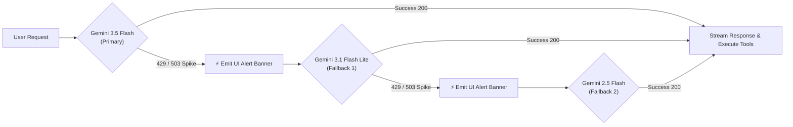

# 🧠 Cognitive Canvas: Autonomous AI Workspace & Planning Engine

[](https://devpost.com)
[](https://ai.google.dev)
[](https://github.com/google/adk)
[](https://cloud.google.com/firestore)

> **"Your workspace that works after you leave."**  
> An autonomous action-taking workspace that turns unstructured thoughts, study goals, and casual reminders into scheduled, dated calendar milestones and actionable project tracking.

---

## 📌 Table of Contents
- [💡 Problem & Value Proposition](#-problem--value-proposition)
- [✨ Key Features](#-key-features)
- [🏗️ System Architecture & Data Flow](#️-system-architecture--data-flow)
- [🧩 Proportional Intent Engine](#-proportional-intent-engine)
- [🛡️ High-Demand & Quota Fallback Cascade](#️-high-demand--quota-fallback-cascade)
- [🛠️ Tech Stack](#️-tech-stack)
- [🚀 Quickstart & Spin-Up Instructions](#-quickstart--spin-up-instructions)
- [🐳 Docker & Google Cloud Run Deployment](#-docker--google-cloud-run-deployment)
- [🔍 Key Findings & Learnings](#-key-findings--learnings)
- [🔮 What's Next](#-whats-next)

---

## 💡 Problem & Value Proposition

### The Problem with Today's AI Chatbots
Most AI productivity tools are **passive conversational loops**:
1. You ask a chatbot to help you plan an exam or schedule a study routine.
2. The bot generates a 500-word block of static text with ambiguous labels like *"Day 1: Read Chapter 1"*.
3. **You still have to do all the heavy lifting:** manually calculating calendar dates, copying tasks into your calendar, creating project trackers, and keeping tabs on completion.

### The Solution: Cognitive Canvas
Cognitive Canvas transforms passive AI into an **autonomous workflow executor**:
* **Proportional Execution:** Drop in a single reminder (*"Schedule a movie date on the 14th"*), and it adds **only one task** to your calendar. Mention a major goal (*"I have an Operating Systems exam in 2 weeks"*), and it autonomously generates a **14-day dated curriculum**, attaches research notes, and sets up project tracking.
* **Temporal Intelligence:** It automatically calculates exact real-world calendar dates (`2026-09-14`) from relative expressions ("next Friday", "on the 14th", "tomorrow").
* **Direct Cloud Action:** Powered by **Google ADK** and **Google Cloud Firestore**, the agent executes real database writes in 1–2 seconds.

---

## ✨ Key Features

| Feature | Description |
| :--- | :--- |
| **🎯 Proportional Intent Engine** | Differentiates between single-day events, multi-week learning curriculums, web research queries, task updates, and general casual conversation. |
| **🗓️ 1-Year Scrollable Horizon Calendar** | 12-month calendar (August 2026 – July 2027) with mathematical date alignment, dynamic day-specific task filtering, and live completion indicators. |
| **🔍 Grounded Web Research** | Automatically queries reference materials, books, and tutorials, persisting summarized findings directly into project notes. |
| **🧠 Multi-Turn Conversational Memory** | Preserves context across turns via Google ADK session management, allowing follow-ups like *"What's on my schedule for that day?"* or *"Mark the first task as done"*. |
| **🛡️ 3-Tier Model Fallback Cascade** | Automatically recovers from rate limits (`429`) or server traffic spikes (`503 UNAVAILABLE`) by cascading from `Gemini 3.5 Flash` ➔ `Gemini 3.1 Flash Lite` ➔ `Gemini 2.5 Flash`. |
| **⚡ Real-Time SSE Streaming** | Live token-by-token streaming response and instant UI state updates. |

---

## 🏗️ System Architecture & Data Flow


---

## 🧩 Proportional Intent Engine

Cognitive Canvas avoids the "one-size-fits-all" trap by routing prompts into 5 distinct operational intents:

```
                               Incoming User Prompt
                                       │
            ┌──────────────────────────┼──────────────────────────┐
            ▼                          ▼                          ▼
   [1. Single Event]           [2. Major Project]         [3. Web Research]
  "Movie date on 14th"        "2-week OS study plan"     "Best Linux books"
            │                          │                          │
   create_task() only        create_project() +          search_web() +
 (No Project Bloat)         plan_project_tasks()       save_research_findings()
            │                          │                          │
            └──────────────────────────┼──────────────────────────┘
                                       │
                                       ▼
                         Google Cloud Firestore Write
                                       │
                                       ▼
                       Live Calendar & Dashboard Update
```

1. **Simple Tasks / Reminders:** Evaluates date math and schedules **only 1 task** on the calendar.
2. **Complex Projects / Study Plans:** Creates a project container and batch-schedules daily, prioritized tasks with duration estimates (e.g. 90m, 120m).
3. **Web Research & Syllabus Exploration:** Gathers verified recommendations and saves them to the project's permanent notes.
4. **Task & Project Management:** Edits deadlines, toggles task statuses, or removes items.
5. **General Dialogue:** Responds with warmth and advice without making database writes.

---

## 🛡️ High-Demand & Quota Fallback Cascade

In production, LLM rate limits (`429 RESOURCE_EXHAUSTED`) or traffic surges (`503 UNAVAILABLE`) can break autonomous agents. 

Cognitive Canvas incorporates an **automatic model cascade**:



* **Zero Crashes:** The user's query seamlessly executes on the next available model.
* **Full Transparency:** The UI displays a live status badge (`Primary` vs `Fallback`) and notification banner.

---

## 🛠️ Tech Stack

| Layer | Technology | Purpose |
| :--- | :--- | :--- |
| **AI & LLM** | **Gemini 3.5 Flash** | Core reasoning, temporal date calculation, and structured tool calling. |
| **Agent Framework** | **Google ADK** (`google.adk`) | Agent definition, `FunctionTool` schema generation, runner, and session memory. |
| **Cloud Database** | **Google Cloud Firestore** | NoSQL document database storing `projects`, `tasks`, and `research_results`. |
| **Backend API** | **FastAPI & Uvicorn** | Asynchronous API gateway with Server-Sent Events (SSE) streaming. |
| **Frontend UI** | **React 18, Vite, Tailwind CSS** | Clean Google Material Skills UI with dynamic calendar, task tracking, and chat sidebar. |
| **Containerization** | **Docker & Google Cloud Run** | Multi-stage production container for cloud deployment. |

---

## 🚀 Quickstart & Spin-Up Instructions

### Prerequisites
* Python 3.11 or 3.12
* Node.js 18+ & npm
* Google Cloud project with Firestore enabled (or Service Account ADC credentials)
* `GEMINI_API_KEY` set in your environment

### 1. Clone the Repository
```bash
git clone https://github.com/DheerajBishnoi/cognitive_canvas.git
cd cognitive_canvas
```

### 2. Backend Setup
```bash
cd cognitive_canvas

# Create and activate virtual environment
python3 -m venv .venv
source .venv/bin/activate

# Install dependencies
pip install -r ../requirements.txt

# Start the unified backend server
python3 server.py
```
*The backend starts on `http://127.0.0.1:8000`.*

### 3. Frontend Setup
In a new terminal:
```bash
cd frontend

# Install dependencies
npm install

# Start development server
npm run dev
```
*Open `http://localhost:5173` in your browser!*

---

## 🐳 Docker & Google Cloud Run Deployment

Build and run the entire stack (Frontend + Backend) inside a single container:

```bash
# Build the unified production container
docker build -t cognitive-canvas .

# Run locally on port 8080
docker run -p 8080:8080 -e GEMINI_API_KEY="your-gemini-api-key" cognitive-canvas
```

Deploying to **Google Cloud Run**:
```bash
gcloud run deploy cognitive-canvas \
  --source . \
  --platform managed \
  --region us-central1 \
  --allow-unauthenticated
```

---

## 🔍 Key Findings & Learnings

1. **Direct Action vs. Multi-Hop Queues:** Initial prototypes used a 6-hop queue-based event dispatcher. We discovered that for an interactive productivity application, direct function execution via Google ADK reduced latency from 25+ seconds to **under 2 seconds**.
2. **Temporal Grounding is Essential:** LLMs excel at relative sequencing ("Day 1", "Day 2"), but scheduling real-world calendars requires dynamic temporal injection (`date_resolver.py`). Providing current temporal anchors allows Gemini to schedule exact calendar dates with 100% precision.
3. **Resilience Matters:** Combining multiple Gemini model tiers (`3.5-flash` ➔ `3.1-flash-lite` ➔ `2.5-flash`) ensures that rate limits or regional traffic spikes never disrupt the user's workflow.

---

## 🔮 What's Next
- **Google Calendar Two-Way Sync:** Bi-directional synchronization with Google Calendar.
- **Voice Note Transcriptions:** Direct voice input transcribing brain dumps on the go.
- **Collaborative Project Canvases:** Multi-user shared workspaces for study groups and team projects.

---

## 👥 Team & Authors
* **Kuldeep Singh Ujjwal**
* **Dheeraj Bishnoi**
